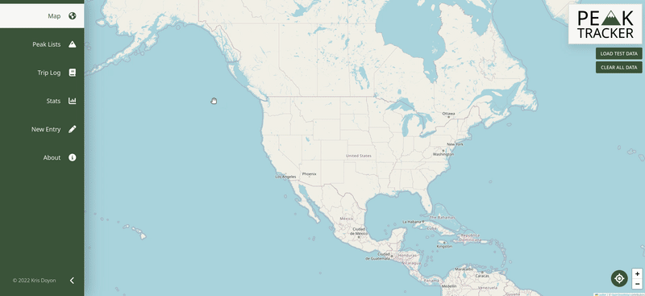
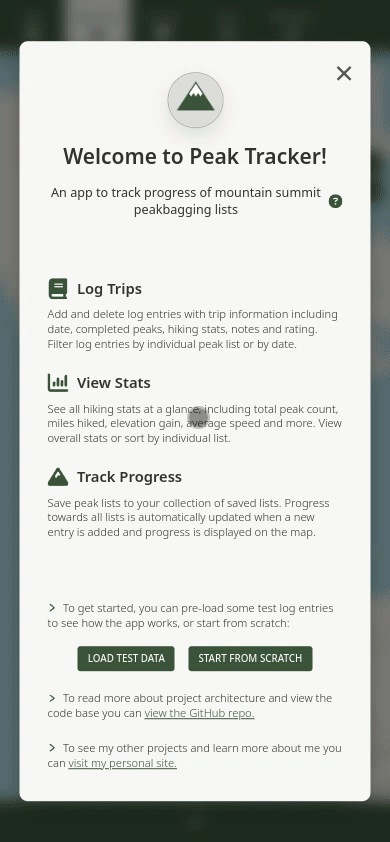
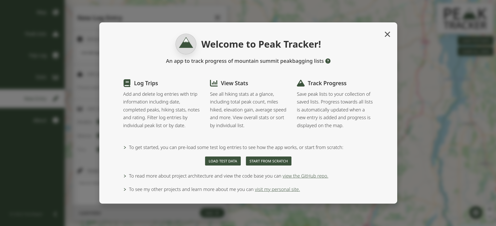
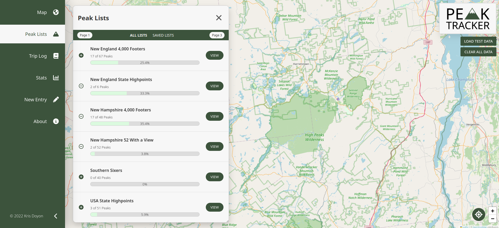
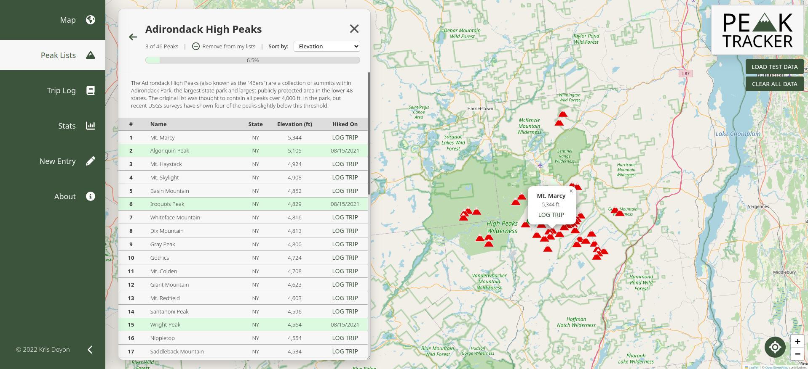
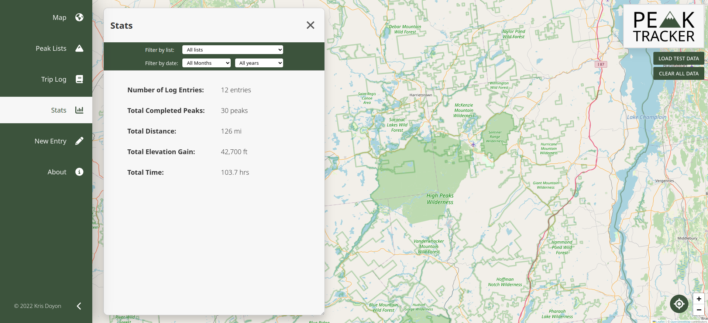
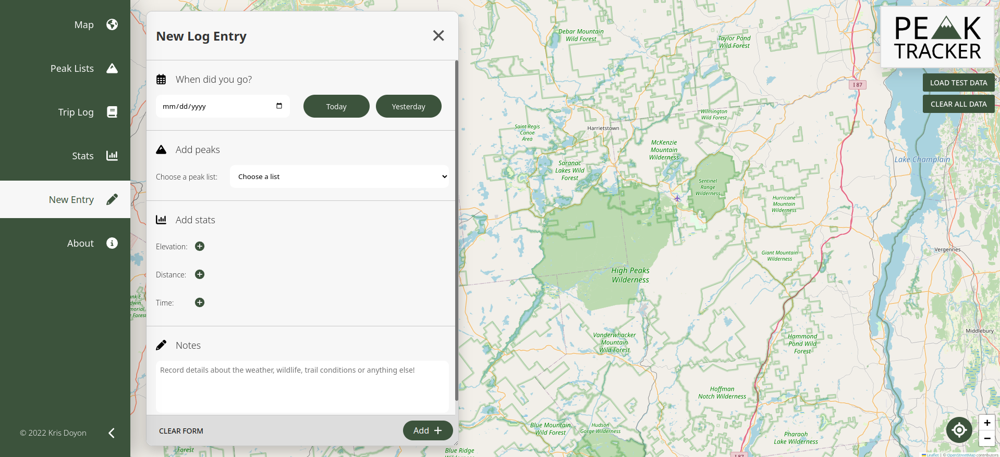

<p align="center">
  
</p>

**Peak Tracker is a JavaScript application designed to track progress of mountain summit peakbagging lists.**

- The live app is available to view and use at: https://peaktracker.krisdoyon.com

- You can view my personal website to learn more about me and see my other projects at: https://krisdoyon.com



# Table of Contents

1. [Overview](#overview)
2. [Features](#features)
3. [Technologies used](#technologies)
4. [Project architecture](#architecture)
5. [Challenges](#challenges)
6. [Data](#data)
7. [Screenshots](#screenshots)

# Overview

<a href="#overview"></a>

I designed this app as a personal project to practice and improve my frontend web development skills using HTML, CSS and JavaScript. I did not use any frameworks as my goal was to focus on fundamentals. I practiced many concepts including DOM manipulation, event delegation, state management, and modern ES6 features such as destructuring, array methods and default parameters.

My motivation for this project was my interest as an avid hiker who is working towards completion of several of the peak lists included in the app. The target user would be someone like myself who has particular hiking and peakbagging goals. Instead of keeping track of peak lists progress manually (on paper, in an Excel spreadsheet, etc.) this app would provide the user with graphical representations of their progress and a more streamlined experience.

# Features

<a href="#features"></a>

Users of the app can:

- Add & remove log entries with information including date, completed peaks, stats, notes and rating.
- Save peak lists to their collection of saved lists.
- View cumulative hiking statistics including total peak count, miles hiked, time spent hiking and more.
- Filter statistics and log entries by individual peak list or by date.
- Sort individual peak list tables by elevation, name and state.
- See visual representations of progress towards peak list completion through progress bars and colored markers on the map.
- Track progress of all included peak lists simultaneously; when a log entry is added or removed progress towards every peak list is updated automatically.

# Technologies Used

<a href="#technologies"></a>

- JavaScript

- HTML

- Sass/SCSS

- Parcel (build for web deployment)

- Leaflet map library (render the map and plot peak markers)

- Local Storage & Session Storage API (store the app state)

- Navigator Geolocation API (get user lat/lon location)

- Open Street Map Nominatim API (get user location address)

# Project Architecture

<a href="#architecture"></a>

#### Model-View-Controller

I designed the app using the model-view-controller architectural pattern. I separated the views into classes (such as peak list previews, stats, log entries, etc.) and views that share similar functionality are extended from common view classes. Each view class that is rendered to the user is imported into the controller. The publisher/subscriber pattern is used for all event handlers with controller functions passed into event handlers published by the view as callbacks and a controller init function is called on the initial page load. The controller module is the only script linked into the HTML head to minimize the number of HTTP requests.

#### State Management

The app state is stored in a state variable which is exported from the model to the controller and stored in local storage. When a user takes actions such as adding a log entry or saving a peak list, the appropriate functions in the model are called by the controller which in turn updates the state and pushes changes to local storage. Examples of values tracked by the state include an object containing key value pairs of peak list IDs with corresponding peak counts, and arrays of user log entries, completed peaks and saved peak lists.

#### Class Components

In addition to the view classes, I used additional ES6 class components to organize peak lists and log entries, with these classes imported for use into the model. The constructor function for the log entry class calls methods which calculate additional stats based on user provided data (such as average speed) and set information for use in the view. Each instance of a peak list class is created from an imported JSON file (more about source data and peak list creation below). I used native JavaScript private fields for privacy encapsulation where applicable.

#### Sass

I used the 7-1 pattern for organizing Sass code by creating partials within each folder to separate abstacts, layout, components, etc. I used an index partial in each folder, @forward for each partial and finally @use for each folder in the main.scss file which is the single stylesheet linked into the HTML head. I used BEM methodology for naming css classes with the goal of creating reusable components wherever possible.

# Challenges

<a href="#challenges"></a>

One challenge that I faced while working on this project was keeping track of the list counts. This was partially due to the fact that some peaks appear on multiple peak lists (for example, Mt. Washington in New Hampshire is on both the NH 4,000 Footers and USA State Highpoints lists along with 3 others lists). Additionally, a user may create multiple log entries with the same peak so adding or removing a log entry does not necessarily mean that the list count should be increased or decreased.

My solution was to:

- Maintain an array of all completed peak IDs (a unique number for each peak) in the model state, independent of peak lists (Mt. Washington appears only once in this array).
- Create 3 functions which each take the peak ID as an argument:

1. getMatchingLists, which returns an array of all matching peak lists to potentially increase/decrease counts for.
2. increaseListCounts, which is called when a user adds a new entry. This function first checks if the peak ID already exists in the completed peaks array. If it does not, it adds the peak ID to the completed peaks array and increases each list count in the model state by 1 for each matching list.
3. decreaseListCounts, which is called when a user removes an existing entry. This function flat maps the completed peak IDs of all log entries into an array and checks if the peak ID exists in this array. If it does not, it decreases the list counts in the model state by 1 for each matching list.

- The increaseListCounts and decreaseListCounts functions are called for each peak ID in the new or removed entry if there are multiple peaks in the entry.

# Data

<a href="#data"></a>

The data for all mountains (latitude, longitude, elevation, etc.) comes from the U.S. Geological Survey (USGS) Geographic Names Information System (GNIS) which maintains a database of natural features in the United States.

Link to USGS GNIS data downloads: https://www.usgs.gov/u.s.-board-on-geographic-names/download-gnis-data

The basic process for creating a peak list is shown below using the Vermont 4,000 footers list as an example.

1. Download the pipe delimited text file for the necessary state(s), which contains data of all feature types with a header (~12,000 cataloged features for Vermont):

```
FEATURE_ID|FEATURE_NAME|FEATURE_CLASS|STATE_ALPHA|STATE_NUMERIC|COUNTY_NAME|COUNTY_NUMERIC|PRIMARY_LAT_DMS|PRIM_LONG_DMS|PRIM_LAT_DEC|PRIM_LONG_DEC|SOURCE_LAT_DMS|SOURCE_LONG_DMS|SOURCE_LAT_DEC|SOURCE_LONG_DEC|ELEV_IN_M|ELEV_IN_FT|MAP_NAME|DATE_CREATED|DATE_EDITED

946367|Lake Champlain|Lake|VT|50|Grand Isle|013|443528N|0731823W|44.5911519|-73.3063442|||||29|95|Colchester Point|01/23/1980|03/09/2020
1458562|Moss Glen Falls|Falls|VT|50|Lamoille|015|442856N|0723727W|44.4821925|-72.6241268|||||301|988|Mount Worcester|10/29/1980|01/17/2015
1459550|Smugglers Notch|Gap|VT|50|Lamoille|015|443319N|0724744W|44.5553294|-72.795679|||||659|2162|Mount Mansfield|10/29/1980|
1457856|Hogback Mountain|Summit|VT|50|Lamoille|015|442527N|0723839W|44.4242217|-72.6442818|||||983|3225|Stowe|10/29/1980|
1460510|Otter Creek|Stream|VT|50|Addison|001|441332N|0731929W|44.2256084|-73.3248477|432229N|0725952W|43.3747946|-72.997882|29|95|Vergennes West|10/29/1980|10/31/2019
...
```

2. Create an array of mountain name strings, then read the file and extract the relevant rows using the writeGNISdata function (NodeJS script):

```js
const vtNames = [
  "Mt. Mansfield",
  "Killington Peak",
  "Camels Hump",
  "Mt. Ellen",
  "Mt. Abraham",
];

writeGNISdata(vtNames, "vt", "vt4k");
```

Outputs a text file (vt4k.txt) with:

```
1461774|Mt. Mansfield|Summit|VT|50|Lamoille|015|443237N|0724851W|44.5436627|-72.8142903|||||1336|4383|Mt.Mansfield|10/29/1980|05/01/2018
1458086|Killington Peak|Summit|VT|50|Rutland|021|433616N|0724912W|43.6045042|-72.8201012|||||1288|4226|Killington Peak|10/29/1980|11/17/2018
1456724|Camels Hump|Summit|VT|50|Washington|023|441910N|0725310W|44.3195001|-72.8862309|||||1241|4071|Huntington|10/29/1980|
1460843|Mt. Ellen|Summit|VT|50|Washington|023|440936N|0725544W|44.16005|-72.9288358|||||1243|4078|Mt.Ellen|10/29/1980|11/15/2018
1460513|Mt. Abraham|Summit|VT|50|Addison|001|440714N|0725610W|44.1204328|-72.9360992|||||1223|4012|Lincoln|10/29/1980|11/15/2018
```

3. Write the peak list text file to a JSON object using the writeJSON function (NodeJS script):

```js
writeJSON(
  "Vermont 4,000 Footers",
  "vt4k",
  `The Vermont 4,000 Footers are a collection of summits over 4,000 ft. in elevation with at least 200 ft of topographic prominence within the state of Vermont. All five summits reside along the 272 mile “Long Trail”, the oldest long distance hiking trail in the United States.`
);
```

4. Import the JSON file and Create an instance of a peak list class

```js
import vt4kJSON from "../json/vt4k.json";
const vt4k = new PeakList(vt4kJSON);
```

5. Add each peak list created using steps 1-4 into a single array which is exported and then imported into the model.

# Screenshots

<a href="#screenshots"></a>

#### Mobile:



#### Welcome Modal:



#### Peak List Preview:



#### Peak List Table:



#### Stats:



#### New Entry Form:




### Typescript

- Enums, generics, type casting, interfaces